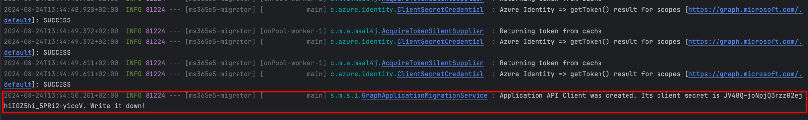

# Microsoft 365 E5 Developer Program Data Migration

<!-- TOC -->
* [Contents](#microsoft-365-e5-developer-program-data-migration)
  * [Problem Statement](#problem-statement)
  * [Features](#features)
  * [Prerequisites](#prerequisites)
  * [Setup](#setup)
  * [Important Notes](#important-notes)
  * [Contributing](#contributing)
  * [License](#license)
<!-- TOC -->

## Problem Statement

Currently, Microsoft 365 E5 Developer Program subscriptions are bound to a single email address, and
reassignment to another email is not supported. The challenge this creates is that, to preserve data
when moving to another subscription account, devs must migrate it manually. The existing Microsoft
[Mover tool](https://mover.io/index.html) does not seem to support migrations from one MS 365 E5
subscription to another, that's why I've decided to create this app.

## Features

- Migrates users and applications from one MS 365 E5 Developer tenant to another.
- Utilizes the Microsoft Graph API to perform data migration.
- Configurable via a simple YAML file.
- Easy to set up and run locally with minimal dependencies.

## Prerequisites

0. **Java 17** or higher installed on your machine.
1. **Microsoft 365 E5 Developer Program Subscriptions**: You need two MS 365 E5 subscriptions (one
   to migrate **from** and one to migrate **to**).
2. **Microsoft Graph API Application Registrations**: Ensure you have appropriate migration
   application registrations permissions for both the source and destination tenants. It will be
   covered later in the readme.
3. **Admin Consent For Application Registrations Permissions**: Admin consent must be provided for
   the required Graph API permissions manually.

## Setup

0. **Set up Migration Application Registrations**

You need to create applications in both the from and to tenants with appropriate Microsoft Graph API
permissions:

- **From Tenant**:
    - `User.Read.All`
    - `Application.Read.All`
- **To Tenant**:
    - `User.ReadWrite.All`
    - `Domain.Read.All`
    - `Application.ReadWrite.All`

For detailed steps, refer to the official Microsoft documentation on setting up
[App Registration.](https://docs.microsoft.com/en-us/azure/active-directory/develop/quickstart-register-app)

Don't forget to grant admin consent for the required permissions in both tenants. Refer to
the [Microsoft documentation](https://docs.microsoft.com/en-us/azure/active-directory/manage-apps/grant-admin-consent)
for guidance on how to perform this step.

1. **Clone the Repository**

Start by cloning the repository:

```bash
git clone https://github.com/daverbk/ms365e5-migrator.git
cd ms365e5-migrator
```

2. **Configure the Application**

Open the `application.yml` file located in `src/main/resources/` and edit the following fields with
your specific tenant information:

```yaml
migration:
    from:
        client-id: add client id of an app's registration of a tenant to migrate FROM here
        client-secret: add client secret of an app's registration of a tenant to migrate FROM here
        tenant-id: add tenant id to migrate FROM here
    to:
        client-id: add client id of an app's registration of a tenant to migrate TO here
        client-secret: add client secret of an app's registration of a tenant to migrate TO here
        tenant-id: add tenant id to migrate TO here
    user-password: add the default user password that will be set for all migrated users here
```

> [!NOTE]
> The `user-password` must be set because the Microsoft Graph API does not allow retrieving user
> passwords. The password specified here will be assigned to all migrated users.

3. Run the Application

After configuring the `application.yml` file, start the migration process by running:

```bash
./gradlew bootRun
```

This command initiates the migration of users and applications from the source tenant to the
destination tenant.

## Important Notes

- **User Passwords**: The users' passwords will not be preserved after migration. This is because
  passwords are inaccessible via the Microsoft Graph API, which is used by the app.
- **License Information**: The E5 license information for users will be preserved after the
  migration.
- **Global Administrator**: The global administrator user will not be migrated. The app identifies a
  global administrator by the presence of assigned business numbers. While this method works for
  most basic development tenants, it may be error-prone if business numbers are assigned to
  non-admin users. This behavior is expected to improve in future updates.
- **Application Registrations**: When application registrations are migrated, only one client secret
  will be retained, as only one secret can be created per app registration. This secret will be
  renewed during migration, and the new secret will be displayed in the console once the migration
  is complete.
  
- **Application Permissions**: An app will preserve permissions for migrated applications, but
  [admin consent](https://docs.microsoft.com/en-us/azure/active-directory/manage-apps/grant-admin-consen)
  must still be granted manually for these permissions.

## Contributing

Contributions are very welcome! If you would like to add support for migrating other entities
besides users and applications, feel free to fork the repository and submit a pull request.

## License

This project is licensed under the MIT License, see the `LICENSE` file for details. I would still
encourage you to contribute to this **public** repo in case you see a way to improve the app. 
